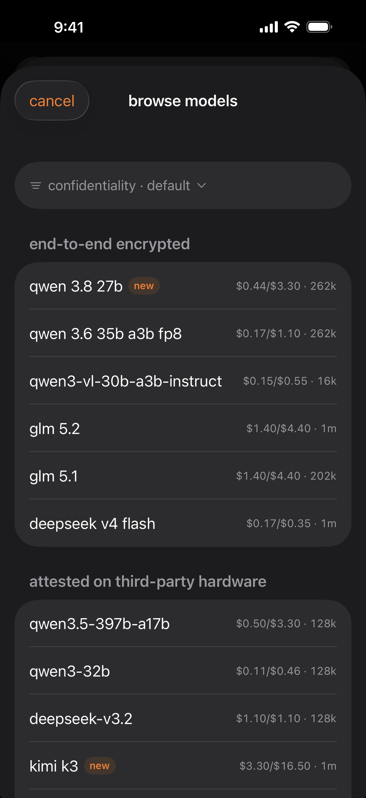
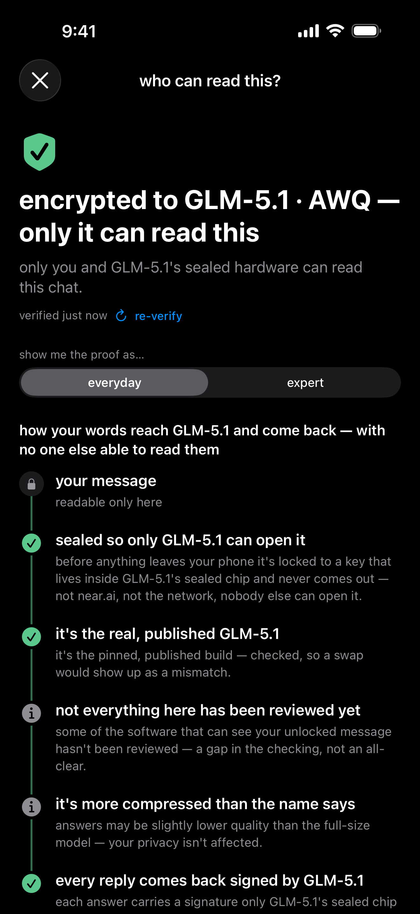
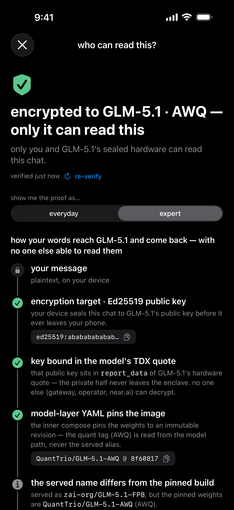
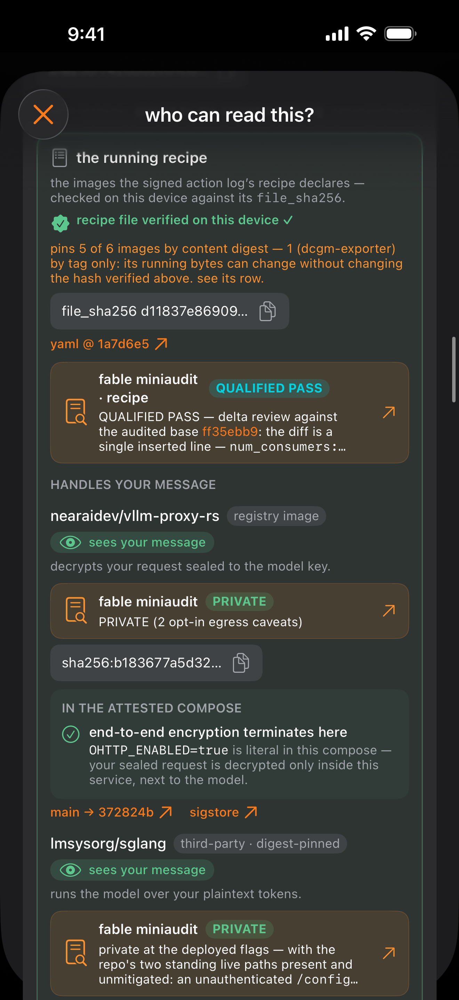
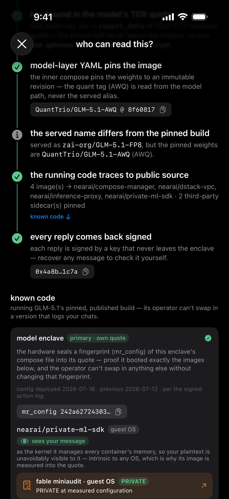

# attestation & verification

on the near.ai confidential-inference path, teemoon does end-to-end encryption into a TEE and
verifies the attestation itself, on the phone, rather than trusting the server's word for it.
this is the full account — what the app checks, how it's surfaced, and, just as carefully,
what it does not prove. for the product overview and the three places a model can run, see
[README.md](README.md); the honesty rule behind all of it lives in [SECURITY.md](SECURITY.md).

## in the app

- An attestation panel showing every check the app ran for the current session, plus
  per-response signature verification — a reply accepted on gateway trust alone is counted
  apart, never as verified.
- A generated self-verification script: copy a standalone python3-stdlib program that fetches
  *fresh* attestations with its own nonces, re-runs near.ai's documented checks on your own
  machine, and compares the live service against what your session saw. `--full` clones
  near.ai's reference verifier for the deep suite.
- Fable miniaudits — every attested image and manifest that can touch your decrypted message
  (found from the enclave's measured compose by `PlaintextExposure`) gets a source-level
  plaintext-exfiltration review — *can it copy your message anywhere but the model?* — surfaced
  in-app with its verdict (e.g. `QUALIFIED PASS`, `PRIVATE`) and keyed to the
  [teemoonai/audits](https://github.com/teemoonai/audits) repo.

  
   <em>browse the near.ai catalog — grouped by confidentiality tier, with pricing and context length</em>

## Verification

"trust me" is not a security model, so on the near.ai path the app performs the
checks itself rather than trusting a server that reports them — and a failed
check blocks the send:

<table>
  <tr>
    <td align="center">
      
    </td>
    <td align="center">
      
    </td>
  </tr>
  <tr>
    <td align="center"><em>everyday — the plain-language ladder</em></td>
    <td align="center"><em>expert — the encryption binding</em></td>
  </tr>
  <tr>
    <td align="center">
      
    </td>
    <td align="center">
      
    </td>
  </tr>
  <tr>
    <td align="center"><em>expert — the recipe checked, with Fable miniaudit verdicts</em></td>
    <td align="center"><em>expert — every image traced to public source</em></td>
  </tr>
</table>

- **TDX quote** — full DCAP verification via `dcap-qvl` (the same library near.ai's own
  verifier uses), including Quoting-Enclave report binding and TCB-status evaluation
  (`DCAPVerifier`); the hand-rolled `TDXQuoteVerifier` stays on as a display parser and
  cross-check tripwire.
  the quote's measurements are what tie the session to a specific, published
  enclave build — proof of *which code* is running, not just that *a* TEE exists.
- **GPU evidence** — the `nvidia_payload` is nonce-checked for freshness and submitted to
  NVIDIA's Remote Attestation Service (`NRASService`).
- **E2EE** — near.ai's E2EE v2 protocol (`E2EEPeer`): ephemeral X25519 ECDH, HKDF-SHA256,
  XChaCha20-Poly1305 via `XChaChaPoly`. The encryption target is the model's **Ed25519** public
  key (converted to X25519 for the ECDH); it is bound to the model enclave by matching its full
  32 bytes against the first 32 bytes of the model quote's `report_data`
  (`e2eeKeyBoundToModelTEE`). Separately, a 20-byte Ethereum-style address — near.ai's ECDSA
  *response-signing* key, not the encryption key — is matched against the first 20 bytes of the
  gateway/GPU quote's `report_data` (`signingKeyBoundToHardware`), and each reply's signature is
  verified against it. The message fields are sealed in the request body — each sealed field
  carries its own ephemeral X25519 public key in the wire envelope — while near.ai's custom HTTP
  headers carry the protocol version and the two Ed25519 identities: `X-Encryption-Version: 2`,
  `X-Encrypt-All-Fields: true`, and the `X-Client-Pub-Key` / `X-Model-Pub-Key` that bind the
  seal to the attested model. So the payload is encrypted *to the model*, not just for the TLS
  hop, and the gateway relays ciphertext it holds no key to open.

  On the hand-written crypto, three facts up front: **HChaCha20 (XChaCha's key-derivation
  step) is the only cipher primitive on this path implemented in Swift — the AEAD itself is
  CryptoKit's `ChaChaPoly`**, so no hand-rolled code encrypts or authenticates a byte. Its
  known-answer tests are the `draft-irtf-cfrg-xchacha-03` vectors, not self-generated ones.
  XChaCha exists here at all only because CryptoKit ships IETF ChaCha20-Poly1305 and not
  XChaCha; the Ed25519→X25519 conversion (TweetNaCl's public-domain field arithmetic,
  operating on public keys only) rejects small-order/degenerate public keys before a peer
  can be built.
- **Provenance and measured config** — the enclave's image digests are checked
  against published Sigstore signatures, and its measured compose is parsed on
  device (`PlaintextExposure`) to identify which images ever see your message
  decrypted.
- **Per-response signatures** — the signer is *recovered* from each secp256k1 signature
  (EIP-191 ecrecover) and must match the bound address, and the signed hashes are recomputed
  from the exact request/response bytes teemoon sent and received (content binding). Keccak-256
  — Ethereum's pre-NIST padding, absent from CryptoKit — is the one other hand-implemented
  primitive here; it hashes only public data, and the ECDSA recovery itself is libsecp256k1.
  Responses accepted only on gateway trust are surfaced as `.unverified(.gatewayTrustOnly)`
  and counted separately, not reported as verified.

Failures are loud: a decrypt failure fails the stream rather than passing ciphertext through,
and a failed check is rendered as a failed check. `AttestationSummary` holds the pass/fail
logic as a plain value type so it can be unit-tested away from SwiftUI.

Attestation proves *which* code is running; it does not tell you whether that
code leaks your plaintext. So beyond the live checks, the attested enclave gets
read: the attestation surfaces the exact images and manifests running inside it,
and a **Fable miniaudit** reads every one of them, asking a single question — can
this component copy your message anywhere but the model? Those per-component
plaintext-exfiltration reviews, keyed to exact attested digests, fail-closed and
never overclaiming, live in the
[teemoonai/audits](https://github.com/teemoonai/audits) repo; the app links to the
review for the exact running identity, and shows no link when there isn't one.

You don't have to trust the app's own verdict either: it generates a standalone
python3-stdlib self-verification script that fetches *fresh* attestations with
its own nonces, re-runs near.ai's documented checks on your own machine, and
compares the live service against what your session saw.

### what this does not prove

Every check above is a real check, and none of them add up to a proof that nobody can read
your conversation. The gaps below are structural, not bugs:

- **Metadata is not sealed, by protocol design.** `encryptRequestBody` seals message content,
  `name`, `refusal`, `tool_calls`, the tool schemas and `tool_choice`, and passes the rest of
  the request through (`E2EEPeer.swift:99-177`). Model id, sampling parameters, the sequence
  of roles, and the count and ciphertext length of your messages stay readable to the gateway.
- **Two failures are deliberately not fatal.** An out-of-date TCB — genuine Intel silicon
  behind on patches — is flagged and the session continues; only a revoked TCB or a quote that
  fails verification breaks it (`DCAPService.swift:33-36`,
  `ConfidentialSession+Verdict.swift:66-71`). And an image digest with no published
  attestation (a clean GitHub 404) keeps the session off green without gating the send,
  because the seal to the attested key is intact
  (`ConfidentialSession+Verdict.swift:182-184`, `:256-261`).
- **The TLS check detects interception rather than preventing it.** The probe accepts any
  server certificate, then compares its SPKI hash to the attested fingerprint
  (`TLSAttestationVerifier.swift:82-85`, `:143-147`) — which is why that request deliberately
  carries no credentials (`:109-117`).
- **Rekor gives an inclusion promise, not an inclusion proof.** The signed entry timestamp
  verifies under the pinned Rekor key; no Merkle proof is fetched
  (`ImageProvenance.swift:25-27`).
- **A gateway-trust-only response is not per-response proof.** It is counted separately and
  never shown as verified (`TEESignatureVerifier.swift:110-115`), but no key you attested
  signed that particular answer.
- **The roots are trusted, not proven.** Intel's SGX Root CA and Sigstore's Fulcio/Rekor keys
  are pinned in the binary (`IntelRootCA.swift:23`, `SigstoreTrustRoot.swift:34`, `:53`), and
  NVIDIA's verdict is trusted over TLS to `nras.attestation.nvidia.com` — the NRAS token's
  own signature is not checked against NVIDIA's JWKS (`NRASService.swift:15-17`). Attestation
  moves trust to the silicon vendors; it does not remove it.
- **The shipped binary is not reproducible.** You can build from this source, but there is no
  published hash to check a shipped build against.
