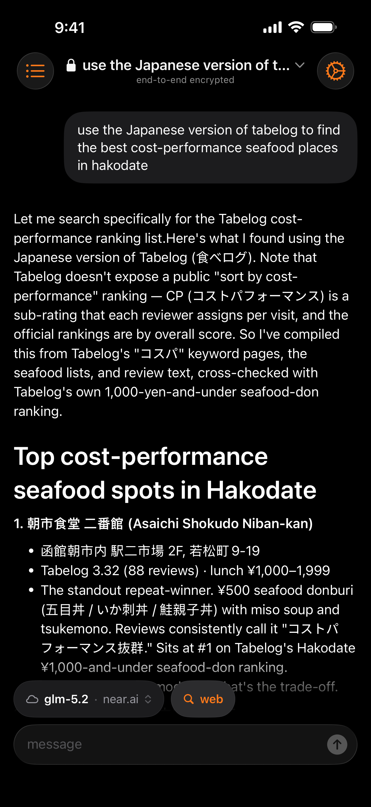
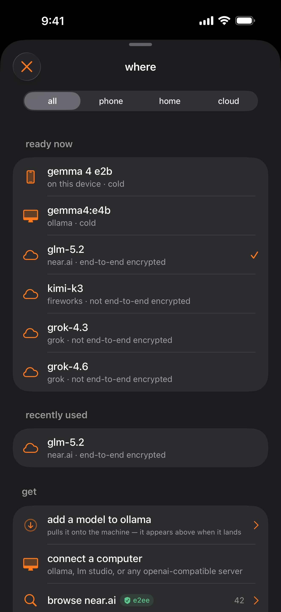
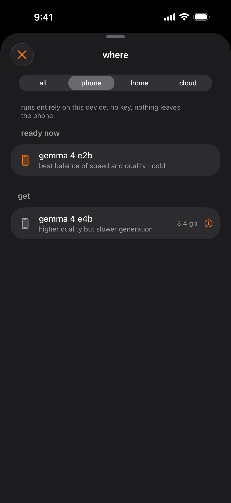
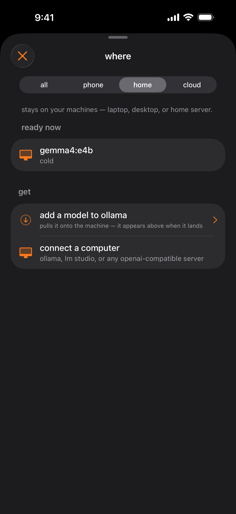
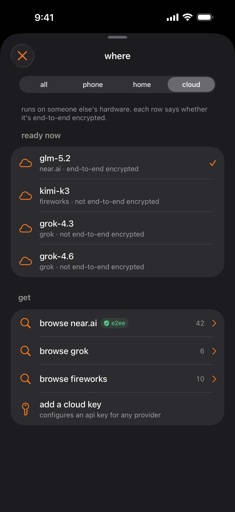

# teemoon

**private AI chat, your key.**

your key, any model — on the phone, a machine you own, or a cloud you pick.
no account, no subscription, no teemoon server.

[teemoon.ai](https://teemoon.ai) · [App Store](https://apps.apple.com/app/id6762371161) ·
beta builds on [TestFlight](https://testflight.apple.com/join/WHZ9VPms) · requires iOS 18.6

<p align="center">
  
</p>

teemoon is a private AI chat app. there is no teemoon server. your phone talks
directly to the model you pick. run a model on the phone, connect a computer you
own, or paste a cloud API key. keys live in the iOS Keychain. chats stay on the
device — SwiftData, no iCloud.

this repository is the whole client — there's no teemoon account system or
backend behind it. the one part you can't audit from here is the remote model
server you connect to; verifying that server without having to trust it is
exactly what the attestation code does — see [`ATTESTATION.md`](ATTESTATION.md).

## Features

- no account, no subscription, no analytics. local history in SwiftData;
  nothing syncs anywhere.
- Streaming chat over SSE, with collapsible reasoning blocks for thinking models. Output
  pacing is a `CADisplayLink` in the view layer; the model layer publishes tokens unthrottled.
- On-device inference with Gemma 4 E2B/E4B via LiteRT-LM, tool calling included. Weights are
  downloaded once and SHA-verified.
- Web search the model can call: Brave's LLM Context API exposed as a `web_search` tool,
  with inline citations and the sources surfaced in the conversation. (Distinct from Brave
  Answers, the search-grounded provider preset — different API, different key.)
- Model browser with per-endpoint catalogs and capability gating — context length, tool
  support, and vision are read from the catalog, not assumed.
- A last-request debug view showing exactly what went over the wire — URL, headers, request
  body (message history included), any tool calls (name, arguments, result), and response
  body, in collapsible sections. Always shown when a request fails; on every request with
  developer mode enabled. Key-bearing headers are redacted on the copy path.

The attestation and verification features — the on-device attestation panel, the generated
self-verification script, and the Fable miniaudits — are described in
[`ATTESTATION.md`](ATTESTATION.md).

## where your model runs

<table>
  <tr>
    <td align="center">
      
    </td>
    <td align="center">
      
    </td>
  </tr>
  <tr>
    <td align="center"><em>every model in one list — labeled per row</em></td>
    <td align="center"><em>your phone — no key, offline</em></td>
  </tr>
  <tr>
    <td align="center">
      
    </td>
    <td align="center">
      
    </td>
  </tr>
  <tr>
    <td align="center"><em>a computer you own</em></td>
    <td align="center"><em>a cloud you pick</em></td>
  </tr>
</table>

- **this phone** — Gemma 4 E2B/E4B via LiteRT-LM, tool calling included. no key,
  works offline, nothing leaves the device.
- **a computer you own** — first-class, not a fallback: llama.cpp, ollama,
  LM Studio, or any OpenAI-compatible server. the app can even browse and
  download models onto your own ollama server.
- **a cloud you pick** — bring your own key for near.ai, Grok, Fireworks, Brave
  Answers, and other OpenAI-compatible providers. (an Anthropic key does not work: the app
  speaks chat/completions, not `/v1/messages` — Claude models are reachable only
  proxied via near.ai.)

**end-to-end encryption is near.ai's attested TEE fleet only. every other cloud
provider is plain TLS. the app labels this per row** — that's the screenshot
above, and the honesty rule the project is built around:
[`SECURITY.md`](SECURITY.md) treats copy that overstates what the code verifies
as a security bug.

| place | transport | trust |
|---|---|---|
| this phone | `LiteRTTransport` — Gemma 4 E2B/E4B via LiteRT-LM | nothing leaves the device |
| home | `HTTPTransport` — ollama, LM Studio, or any OpenAI-compatible server | your hardware |
| near.ai | `HTTPTransport` over HTTPS/SSE, request sealed by `E2EEPeer` | attested TEE, E2EE, verified on device |
| Grok, Fireworks, Brave Answers | same, without the enclave | ordinary BYOK cloud |
| custom | any OpenAI-compatible endpoint | whatever you point it at |

`GenerationEngine` is transport-agnostic: the tool-calling loop, message
construction, and streaming behave identically whether a model runs on near.ai
or on the phone.

## Verification

"trust me" is not a security model, so on the near.ai path the app performs the attestation
checks itself rather than trusting a server that reports them — and it is explicit about what
those checks do, and do not, prove. the full account, with screenshots, is in
**[`ATTESTATION.md`](ATTESTATION.md)** → [what this does not prove](ATTESTATION.md#what-this-does-not-prove).

## What's in the tree

Three local Swift packages live in [`Packages/`](Packages):

- `LiteRTLM` — Google's LiteRT-LM runtime, used for on-device inference
- `ModelBackend` — model execution and download plumbing
- `TDXQuoteVerifier` — hand-rolled Intel TDX quote parsing

Remote dependencies are pinned in
`teemoon.xcodeproj/project.xcworkspace/xcshareddata/swiftpm/Package.resolved`. The notable ones are
[AnyLanguageModel](https://github.com/huggingface/AnyLanguageModel) (the `LanguageModel`
protocol teemoon conforms to), [dcap-qvl-swift](https://github.com/Phala-Network/dcap-qvl-swift)
(DCAP verification), and [swift-secp256k1](https://github.com/21-DOT-DEV/swift-secp256k1).
[textual](https://github.com/gonzalezreal/textual) (Markdown rendering) is vendored at
`Vendor/textual`, not consumed by URL — see [`Vendor/textual/VENDORING.md`](Vendor/textual/VENDORING.md).

## Building

Requires Xcode 26 or newer, and **`git-lfs` installed before you clone**. No API keys are
needed to build or to run the test suite.

```
brew install git-lfs && git lfs install
git clone https://github.com/teemoonai/teemoon-ios.git
cd teemoon-ios
open teemoon.xcodeproj
```

LFS is not optional, on any platform. `Packages/LiteRTLM/artifacts/` holds a repackaged macOS
xcframework (132 MB) that `Package.swift` references by path, and SwiftPM validates that path
when the manifest loads. Clone without LFS and you get a text pointer instead of the binary,
the package fails to resolve at all, and the iOS build goes down with it. See
[`Packages/LiteRTLM/VENDORING.md`](Packages/LiteRTLM/VENDORING.md) for what the artifact is,
why it has to be repackaged, and how to reproduce it.

Select the `teemoon` scheme and an iOS 26 simulator. First build resolves Swift packages, so
it needs network. The app target is iOS 18.6+; the test targets are iOS 26.4+.

Both are floors, not pins. Any simulator runtime at or above them works — the suite is
verified on iOS 26.5, and you do not need a 26.4 runtime installed to satisfy 26.4. The
corollary is worth knowing before you tidy up Xcode's Platforms pane: a runtime below 18.6
cannot run the app at all, so an old iOS 18.x image is dead weight, while anything 26.4 or
newer will run the tests.

The project also carries a native macOS destination (macOS 15.6, not Catalyst) and the Vision
device family. Neither is a separate release target — the iPhone app is what ships (the target
is iPhone-only, `TARGETED_DEVICE_FAMILY = 1`; Apple Silicon Macs and Vision run that same app).

## Testing

```
xcodebuild test -project teemoon.xcodeproj -scheme teemoon \
  -destination 'platform=iOS Simulator,name=iPhone 17 Pro' \
  -only-testing:teemoonTests
```

The unit suite is offline: no keys, no network. Engine tests drive the real production path
through a stub `URLProtocol` — streaming, the tool loop, E2EE seal/decrypt round-trips,
decrypt failure, and HTTP error draining.

`NearAIBenchmarkTests` and `GLM5BraveSearchTests` hit live paid services and are permanently
`.disabled`. To run them, remove the trait locally and supply `NEAR_AI_API_KEY` /
`BRAVE_API_KEY` as environment variables or in `~/.NEAR_AI_API_KEY` / `~/.BRAVE_API_KEY`.
Note that `ProviderSmokeTests`, `ProductLiveEndpointTests`, and `GroundingLiveTests`
self-activate when those key files exist — if you have e.g. `~/.NEAR_AI_API_KEY` present,
running the full suite makes real (possibly paid) network requests. To keep a run offline,
remove/rename the key files, or skip those suites the way CI does (the `-skip-testing:`
list in `.github/workflows/test.yml`).

`teemoonUITests` includes a screenshot suite used to generate App Store captures.

## Layout

```
teemoon/App/            app entry, intents, platform glue
teemoon/Chat/           SwiftData models, chat view model
teemoon/Inference/      generation loop, transports, SSE parsing, tools
teemoon/Confidential/   attestation, quote verification, E2EE
teemoon/Providers/      provider presets, catalogs, config, keychain
teemoon/Presentation/   provider presentation for the Where UI
teemoon/Settings/       appearance and app settings
teemoon/Support/        hang reporter, background work
teemoon/Views/          SwiftUI views (Chat/, Onboarding/, Settings/, Where/)
teemoonTests/           offline unit tests
teemoonUITests/         UI and screenshot tests
Packages/               local Swift packages
Vendor/                 vendored third-party packages
```

The conversation store (`teemoon/Chat/`, SwiftData) is versioned via `SchemaVersioning.swift`:
every schema change is an explicit migration stage, and a failed store open never deletes data —
the app runs in-memory for that session, says so, and leaves the file untouched on disk.

## Documentation

This repository publishes the code. The project's internal design documents — architecture,
attestation flow, data model, the design system — are not part of the published tree.

Code comments that cite `docs/*.md` are left as written. They are a record of which internal
document governed a decision, and rewriting them would erase that provenance; treat them as
citations, not as links you can follow. The same applies to comments that cite an internal
design doc by name or by bare section number (§N): they refer to that internal record, not
to anything in this repo.

What does ship, and is meant to stand on its own:

- **Attestation and what it proves** — [`ATTESTATION.md`](ATTESTATION.md), including
  [what this does not prove](ATTESTATION.md#what-this-does-not-prove).
- **Per-model source audits** — the [teemoonai/audits](https://github.com/teemoonai/audits)
  repo: plaintext-exfiltration reviews keyed to exact attested identities.
- **Vendoring** — [`Vendor/textual/VENDORING.md`](Vendor/textual/VENDORING.md) and
  [`Packages/LiteRTLM/VENDORING.md`](Packages/LiteRTLM/VENDORING.md): why each is an in-tree
  copy, every delta from upstream, and how to bump one without losing a patch.
- **Contributing** — [`CONTRIBUTING.md`](CONTRIBUTING.md).
- **Security policy** — [`SECURITY.md`](SECURITY.md).
- **Third-party attributions** — [`THIRD_PARTY_NOTICES.md`](THIRD_PARTY_NOTICES.md).

Beyond that, the source is the documentation: the attestation and E2EE files in
`teemoon/Confidential/` carry their protocol notes and trust-model caveats in file headers.

## Contributing

Bug reports and pull requests are welcome. Fixes should come with a regression test, and the
unit suite must stay offline and green.

Copy that overstates what the code verifies is treated as a bug of the same severity as a
missing check. If you change anything on the attestation or E2EE path, the claims in the UI
have to move with it.

teemoon is AGPL-3.0 and is also distributed through the App Store by the copyright holder, so
external contributions may require a CLA before they can be merged. Open an issue before
writing anything substantial.

Security issues: please don't open a public issue — use
[private vulnerability reporting](https://github.com/teemoonai/teemoon-ios/security/advisories/new).

## Cryptography notice

This distribution includes cryptographic software. The country in which you currently reside
may have restrictions on the import, possession, use, and/or re-export to another country of
encryption software. Before using it, check your country's laws and regulations concerning
the import, possession, use, and re-export of encryption software.

The app declares `ITSAppUsesNonExemptEncryption = NO` for App Store export compliance.
That is a deliberate claim, not an accident: every cryptographic operation teemoon performs
uses standard, published algorithms (X25519/Ed25519, XChaCha20-Poly1305, HKDF, SHA-2, P-256
ECDSA for Sigstore verification, secp256k1 ECDSA recovery with Keccak-256 for
response-signature verification, and TLS via the OS) for authentication, integrity, and
end-to-end encryption of user content — the category 5, part 2 "standard algorithms"
exemption under EAR §740.17(b) / the equivalent mass-market provisions. No proprietary or
non-standard cryptography is implemented or exposed.

## License

Copyright 2026 ringzero ventures llc

Licensed under the GNU AGPLv3: https://www.gnu.org/licenses/agpl-3.0.html

teemoon began as a fork of [fullmoon](https://github.com/mainframecomputer/fullmoon-ios)
(© 2024 Mainframe Computer, Inc.), originally MIT-licensed. That notice and other
third-party attributions are preserved in [`THIRD_PARTY_NOTICES.md`](THIRD_PARTY_NOTICES.md).
